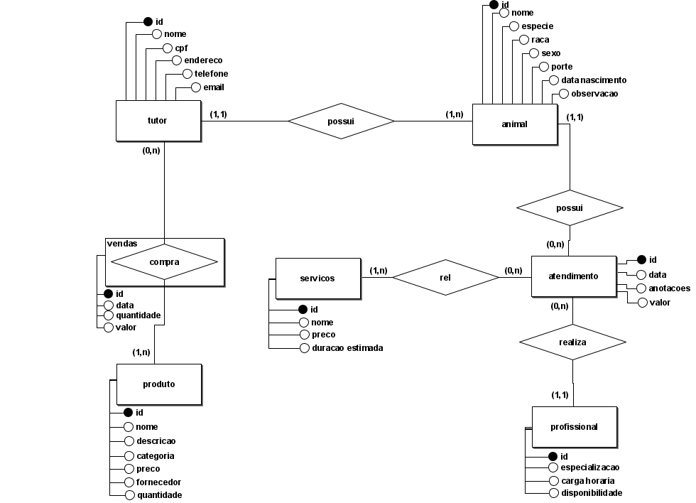
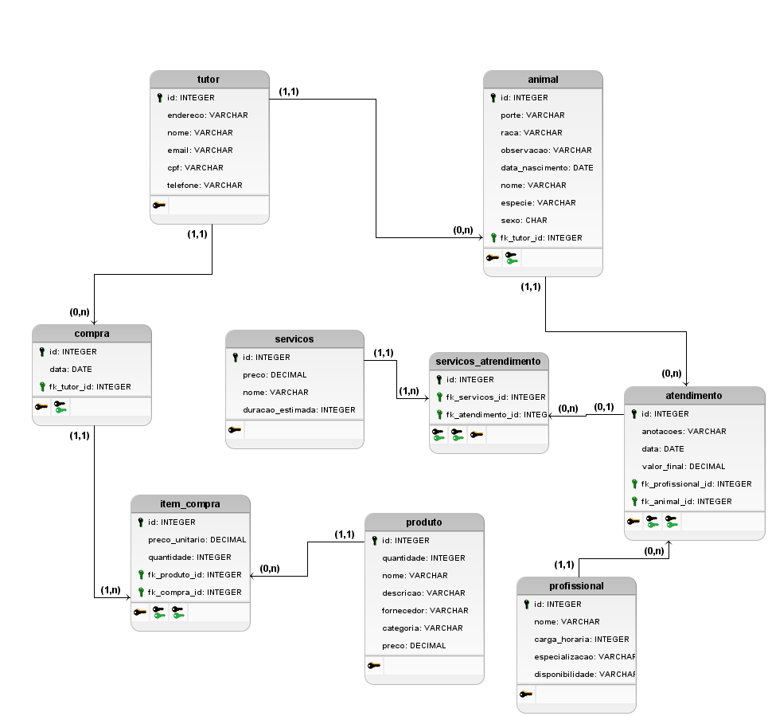

Instituto Federal de Educação, Ciência e Tecnologia da Paraíba \- IFPB  
Curso Superior de Tecnologia em Análise e Desenvolvimento de Sistemas  
Disciplina: Banco de Dados I  \- Período: 2025.1    
Professor: Hugo Feitosa de Figueirêdo

Elabore um esquema Conceitual (Entidade Relacionamento) e o lógico (Relacional) para o seguinte minimundo: 

“Um Pet Shop decidiu implementar um sistema de banco de dados para aprimorar sua gestão e melhorar a experiência dos tutores e de seus animais de estimação. O sistema deverá integrar o controle de **vendas de produtos**, **atendimentos de serviços** e **informações veterinárias**.

Cada cliente pode possuir um ou mais animais cadastrados no sistema. Os dados do tutor incluem nome completo, CPF, endereço, telefone e e-mail. Para cada animal, são registrados o nome, espécie (cão, gato, coelho, etc.), raça, sexo, porte (pequeno, médio, grande), data de nascimento e observações de saúde, como alergias, condições crônicas ou comportamentos específicos. A vinculação entre cliente e animal é essencial para todas as interações no sistema.

O Pet Shop oferece diversos **serviços**, tais como: **Banho, Tosa higiênica ou completa, Consulta veterinária, Aplicação de vacinas, Hospedagem e  Adestramento.** Cada serviço possui um preço-base e duração estimada. O registro de cada atendimento inclui: data e hora, animal atendido, profissional responsável, serviços realizados, anotações (ex: animal agressivo, escoriações, medicamentos aplicados) e valor final cobrado — que pode variar conforme o porte ou a condição do animal.

Todos os profissionais do Pet Shop são cadastrados no sistema com suas especializações (tosador, veterinário, adestrador, etc.), carga horária e disponibilidade por dia da semana.

O Pet Shop também realiza a venda de produtos como rações, brinquedos, roupas, medicamentos, coleiras e shampoos. Cada produto é cadastrado com nome, descrição, categoria, preço, fornecedor e quantidade em estoque. As vendas são registradas por cliente, com data, produtos adquiridos, quantidade e valor total.”

**Esquema Conceitual**

**Esquema Relacional**
