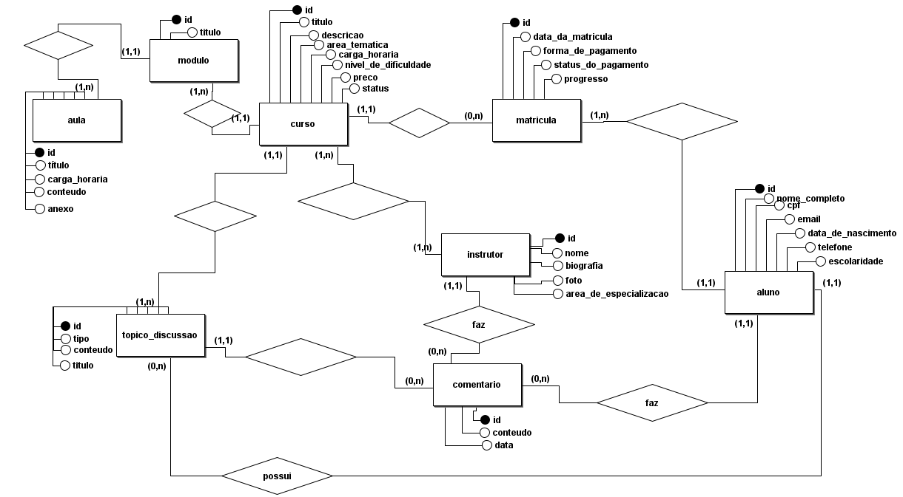

# Plataforma de Cursos

Uma plataforma de cursos online será desenvolvida para oferecer uma experiência de aprendizado personalizada, acessível e escalável. O sistema deve organizar e gerenciar de forma integrada os cursos, instrutores, alunos, conteúdo e avaliações, garantindo um controle preciso do progresso dos estudantes e da qualidade do ensino oferecido.

A base do sistema é o catálogo de cursos. Cada curso possui: Título, Descrição, Área temática, Carga horária, Nível de dificuldade, Preço e Status (ativo, em reformulação, arquivado). Cada curso é composto por módulos e aulas organizadas em sequência. Cada aula deve ter um título, carga horária, conteúdo e um anexo, que pode ser um vídeo, texto, apresentação, link ou atividade avaliativa.

Cada curso tem pelo menos um instrutor responsável. Os instrutores são cadastrados no sistema com nome completo, biografia, foto e área de especialização. 

Para participar dos cursos, os usuários precisam se cadastrar como alunos. As informações armazenadas incluem: Nome completo, CPF, E-mail, Data de nascimento, Telefone e Escolaridade.

Após o cadastro, o aluno pode se matricular em um ou mais cursos, sendo registrado o curso, a data da matrícula, a forma de pagamento, o status do pagamento e o progresso.

Cada curso possui um fórum de discussões, onde os alunos podem criar tópicos com dúvidas, dicas ou sugestões de melhorias. Os instrutores e os outros alunos podem adicionar comentários aos tópicos.

<h2>Esquema Conceitual</h2>
